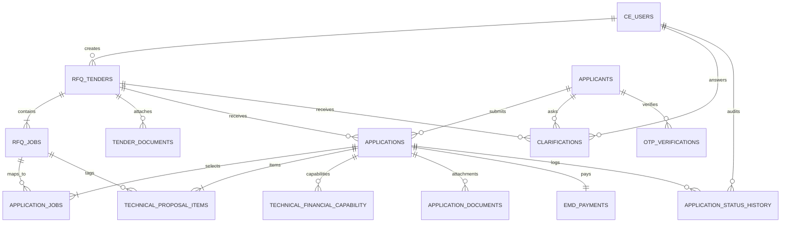

# Amaravati Infrastructure RFQ Portal: Comprehensive System Design & Database Documentation

> **Document Version**: 2.0.0  
> **Target System**: Request for Quotation (RFQ) Tender Management & Multi-Job Bidding Portal  
> **Procuring Authority**: Amaravati Growth and Infrastructure Corporation Limited (AGIC)  
> **Last Updated**: September 2026  

---

## 1. Executive Summary & Purpose

The **AGIC RFQ Portal** is a mission-critical web application designed for transparent, auditable, and high-performance procurement of engineering, civil, and fabrication works. It enables:

1. **Chief Engineers (CE)** to raise structured RFQ tenders partitioned into distinct **Work Packages / Jobs**, publish technical specifications, monitor pre-bid queries, and evaluate competitive applicant quotations through automated **L1 comparative matrices** and audit history logs.
2. **Contractors / Applicants** to securely register their firm, inspect open tenders with hard cutoff countdowns, select specific work packages to bid for, submit itemized unit rate breakdowns (**Annexure III**), verify past credentials (**Annexure II**), upload EMD proofs, and monitor evaluation progress under strict role-based data isolation.

---

## 2. High-Level Architecture & Tech Stack

```
+-----------------------------------------------------------------------------------------+
|                                    CLIENT LAYER                                         |
|                                                                                         |
|  +-----------------------------------------------------------------------------------+  |
|  |                    React 19 + Vite 8 SPA (Tailwind CSS 3.4)                       |  |
|  |                                                                                   |  |
|  |   [Public Portal]       [Applicant Workflow]             [Chief Engineer Admin]   |  |
|  |   - Tender Explorer     - Signatory & Letter             - Raise Tender & Jobs    |  |
|  |   - Specifications      - Multi-Job Selector             - L1 Comparative Matrix  |  |
|  |   - Countdown Timers    - Annexure II / III Builder      - Dossier Audit Review   |  |
|  |   - Clarifications      - EMD & Docs Upload              - Clarification Replies  |  |
|  +-----------------------------------------------------------------------------------+  |
+--------------------------------------------+--------------------------------------------+
                                             | HTTPS / JSON REST API
                                             v
+-----------------------------------------------------------------------------------------+
|                                 APPLICATION BACKEND                                      |
|                                                                                         |
|  +-----------------------------------------------------------------------------------+  |
|  |                       FastAPI (Python 3.12 ASGI Framework)                        |  |
|  |                                                                                   |  |
|  |   [Security / Auth]      [Tenders Router]             [Applications Router]       |  |
|  |   - JWT Token Auth       - Tender CRUD                - Job Selection Validation  |  |
|  |   - Passlib PBKDF2       - Job Package Management     - Rate x Qty Calculation    |  |
|  |   - Role Gatekeeper      - Document Attachments       - Status History Audit Log  |  |
|  +-----------------------------------------------------------------------------------+  |
+--------------------------------------------+--------------------------------------------+
                                             | SQLAlchemy 2.0 ORM / Connection Pool
                                             v
+-----------------------------------------------------------------------------------------+
|                                  DATA PERSISTENCE                                       |
|                                                                                         |
|  +-----------------------------------------------------------------------------------+  |
|  |                   PostgreSQL 15+ / SQLite 3 (Production Schema)                   |  |
|  |                                                                                   |  |
|  |   - ce_users               - rfq_tenders              - applications              |  |
|  |   - applicants             - rfq_jobs                 - application_jobs          |  |
|  |   - otp_verifications      - tender_documents         - technical_proposal_items  |  |
|  |   - clarifications         - emd_payments             - application_status_history|  |
|  +-----------------------------------------------------------------------------------+  |
+-----------------------------------------------------------------------------------------+
```

### Technology Matrix

| Layer | Component | Version | Role & Responsibilities |
|---|---|---|---|
| **Frontend UI** | React | `^19.2.8` | Component-based reactive UI rendering |
| **Build Tool** | Vite | `^8.2.2` | Ultra-fast HMR and optimized production bundling |
| **Styling** | Tailwind CSS | `^3.4.17` | Utility-first responsive design with institutional theme |
| **Icons** | Lucide React | `^1.38.0` | High-fidelity UI iconography |
| **Routing** | React Router DOM | `^7.18.3` | Declarative client-side routing & auth protection |
| **HTTP Client** | Axios | `^1.20.0` | JWT-authenticated REST communication with interceptors |
| **Backend API** | FastAPI | `0.115+` | High-throughput asynchronous Python web framework |
| **Validation** | Pydantic | `v2.x` | Strict request/response validation & serialization |
| **ORM** | SQLAlchemy | `2.0+` | Relational database mapping & transaction management |
| **Security** | Python-Jose & Passlib | `3.3.0` | JWT encryption & PBKDF2/Bcrypt password hashing |
| **Database** | PostgreSQL / SQLite | `15+` | ACID-compliant relational persistence store |

---

## 3. Complete Database Architecture & ER Diagram

The database schema models the lifecycle of multi-job tenders, contractor eligibility, line-item quotations, earnest money payments, and official audit history.



---

### Data Dictionary (Complete Table Specifications)

#### 1. `ce_users` (Chief Engineers & Procuring Officers)
Stores credentials and organizational metadata for authorized government engineers.

| Column | Type | Constraints | Description |
|---|---|---|---|
| `ce_id` | `BigInteger` | `PK, Auto-increment` | Unique identifier for the Chief Engineer |
| `name` | `String(150)` | `NOT NULL` | Full legal name and designation |
| `mobile_no` | `String(15)` | `NOT NULL, UNIQUE, INDEX` | 10-digit login mobile number |
| `email` | `String(150)` | `NULLABLE` | Official government email address |
| `password_hash` | `Text` | `NOT NULL` | Hashed password via PBKDF2/Bcrypt |
| `designation` | `String(100)` | `DEFAULT "Chief Engineer"` | Formal government post designation |
| `role` | `String(20)` | `NOT NULL, DEFAULT "CE"` | System authorization role |
| `is_active` | `Boolean` | `NOT NULL, DEFAULT True` | Account enablement flag |
| `created_at` | `DateTime` | `DEFAULT now()` | Record creation timestamp |
| `updated_at` | `DateTime` | `DEFAULT now()` | Last update timestamp |

---

#### 2. `applicants` (Contractor / Bidder Firms)
Stores registered contracting firms participating in RFQ tenders.

| Column | Type | Constraints | Description |
|---|---|---|---|
| `applicant_id` | `BigInteger` | `PK, Auto-increment` | Unique identifier for contractor firm |
| `mobile_no` | `String(15)` | `NOT NULL, UNIQUE, INDEX` | Registered mobile number for OTP/login |
| `firm_name` | `String(255)` | `NOT NULL` | Registered trade/corporate firm name |
| `registration_type` | `String(100)` | `NULLABLE` | Entity type (Pvt Ltd, LLP, Partnership, etc.) |
| `prime_line_business`| `String(255)` | `NULLABLE` | Primary domain (e.g. Steel Fabrication) |
| `chairperson_name` | `String(150)` | `NULLABLE` | Chairperson / Director name |
| `md_ceo_name` | `String(150)` | `NULLABLE` | Managing Director / CEO name |
| `postal_address` | `Text` | `NULLABLE` | Registered head office postal address |
| `email` | `String(150)` | `NULLABLE` | Corporate contact email |
| `gstin` | `String(20)` | `NULLABLE` | 15-character Goods & Services Tax ID |
| `pan_no` | `String(20)` | `NULLABLE` | Permanent Account Number |
| `password_hash` | `Text` | `NULLABLE` | Optional password for non-OTP login |
| `mobile_verified` | `Boolean` | `NOT NULL, DEFAULT False` | Mobile OTP verification flag |
| `is_active` | `Boolean` | `NOT NULL, DEFAULT True` | Contractor eligibility status |
| `created_at` | `DateTime` | `DEFAULT now()` | Profile creation timestamp |
| `updated_at` | `DateTime` | `DEFAULT now()` | Last profile modification timestamp |

---

#### 3. `rfq_tenders` (Master RFQ Tenders)
Stores high-level tender definitions, physical specs, EMD, and quotation window cutoffs.

| Column | Type | Constraints | Description |
|---|---|---|---|
| `tender_id` | `BigInteger` | `PK, Auto-increment` | Primary key |
| `tender_ref_no` | `String(50)` | `NOT NULL, UNIQUE, INDEX`| Official reference (e.g. `RFQ/AGIC/2026/INFRA-01`)|
| `title` | `Text` | `NOT NULL` | Full title of the engineering work |
| `authority_name` | `String(255)` | `NOT NULL, DEFAULT "AGIC"`| Procuring government department / body |
| `background` | `Text` | `NULLABLE` | Infrastructure project background |
| `scope_of_work` | `Text` | `NULLABLE` | Overarching technical requirements |
| `total_elements` | `Integer` | `NULLABLE` | Total element count (pieces) |
| `element_types` | `Integer` | `NULLABLE` | Number of distinct structural types |
| `max_weight_mt` | `Numeric(8,2)`| `NULLABLE` | Maximum component weight (Metric Tonnes) |
| `min_weight_mt` | `Numeric(8,2)`| `NULLABLE` | Minimum component weight (Metric Tonnes) |
| `avg_weight_mt` | `Numeric(8,2)`| `NULLABLE` | Average component weight (Metric Tonnes) |
| `emd_amount` | `Numeric(12,2)`| `NOT NULL, DEFAULT 0` | Mandatory Earnest Money Deposit in INR |
| `completion_period`| `String(50)` | `NULLABLE` | Contract duration (e.g. "12 Months") |
| `quotation_from_date`| `DateTime` | `NOT NULL` | Opening of the quotation bidding window |
| `quotation_to_date`| `DateTime` | `NOT NULL` | **Strict cutoff** timestamp for submissions |
| `opening_date` | `DateTime` | `NULLABLE` | Scheduled commercial opening timestamp |
| `contact_person` | `String(150)` | `NULLABLE` | Executive Engineer in charge |
| `contact_email` | `String(150)` | `NULLABLE` | Official contact email |
| `contact_phone` | `String(20)` | `NULLABLE` | Official contact telephone number |
| `office_address` | `Text` | `NULLABLE` | Physical submission / office address |
| `status` | `String(20)` | `NOT NULL, INDEX` | `DRAFT`, `PUBLISHED`, `CLOSED`, `CANCELLED` |
| `created_by` | `BigInteger` | `NOT NULL` | `ce_id` of the authoring engineer |
| `created_at` | `DateTime` | `DEFAULT now()` | Record creation timestamp |
| `updated_at` | `DateTime` | `DEFAULT now()` | Last update timestamp |

---

#### 4. `rfq_jobs` (Work Packages Under a Tender)
Enables multi-job partitioning under a single master tender.

| Column | Type | Constraints | Description |
|---|---|---|---|
| `job_id` | `BigInteger` | `PK, Auto-increment` | Primary key |
| `tender_id` | `BigInteger` | `NOT NULL, INDEX` | Foreign Key -> `rfq_tenders.tender_id` |
| `job_code` | `String(30)` | `NULLABLE` | Human-readable code (e.g. `JOB-INFRA-01-FAB`) |
| `job_name` | `String(255)` | `NOT NULL` | Title of the work package |
| `job_description` | `Text` | `NULLABLE` | Technical deliverables and specifications |
| `category` | `String(100)` | `NULLABLE` | Trade category (Fabrication, Erection, Roofing) |
| `estimated_quantity`| `Numeric(12,2)`| `NULLABLE` | Quantified scope |
| `unit` | `String(30)` | `NULLABLE` | Engineering unit (MT, SQM, NOS, RMT) |
| `estimated_cost` | `Numeric(16,2)`| `NULLABLE` | Estimated budget allocation in INR |
| `completion_period`| `String(50)` | `NULLABLE` | Work package timeline (e.g. "6 Months") |
| `status` | `String(20)` | `NOT NULL, DEFAULT "ACTIVE"`| `ACTIVE` or `INACTIVE` |
| `created_at` | `DateTime` | `DEFAULT now()` | Creation timestamp |
| `updated_at` | `DateTime` | `DEFAULT now()` | Last update timestamp |

---

#### 5. `applications` (Quotation Dossier Header)
Represents a submitted bid dossier from an applicant for a specific tender.

| Column | Type | Constraints | Description |
|---|---|---|---|
| `application_id` | `BigInteger` | `PK, Auto-increment` | Primary key |
| `tender_id` | `BigInteger` | `NOT NULL, INDEX` | Foreign Key -> `rfq_tenders.tender_id` |
| `applicant_id` | `BigInteger` | `NOT NULL, INDEX` | Foreign Key -> `applicants.applicant_id` |
| `application_no` | `String(50)` | `UNIQUE, NOT NULL` | Unique docket no (`APP-TID-AID-TIMESTAMP`) |
| `covering_letter_date`| `Date` | `NULLABLE` | Formal covering letter date |
| `signatory_name` | `String(150)` | `NULLABLE` | Authorized signatory legal name |
| `signatory_designation`| `String(150)`| `NULLABLE` | Signatory title / corporate position |
| `quoted_amount` | `Numeric(16,2)`| `NULLABLE` | Computed grand total bid in INR |
| `status` | `String(30)` | `NOT NULL, INDEX` | `SUBMITTED`, `UNDER_REVIEW`, `ACCEPTED`, `REJECTED`, `WITHDRAWN` |
| `remarks` | `Text` | `NULLABLE` | Audit notes / evaluation justification |
| `submitted_at` | `DateTime` | `DEFAULT now()` | Official submission timestamp |
| `created_at` | `DateTime` | `DEFAULT now()` | Initial draft timestamp |
| `updated_at` | `DateTime` | `DEFAULT now()` | Last status update timestamp |

---

#### 6. `application_jobs` (Applicant Work Package Selection)
Links which specific job packages an applicant is quoting for.

| Column | Type | Constraints | Description |
|---|---|---|---|
| `application_job_id`| `BigInteger` | `PK, Auto-increment` | Primary key |
| `application_id` | `BigInteger` | `NOT NULL, INDEX` | Foreign Key -> `applications.application_id` |
| `job_id` | `BigInteger` | `NOT NULL, INDEX` | Foreign Key -> `rfq_jobs.job_id` |
| `quoted_amount` | `Numeric(16,2)`| `NULLABLE` | Sub-total quoted for this specific job |
| `remarks` | `Text` | `NULLABLE` | Applicant remarks for this job |
| `status` | `String(20)` | `NOT NULL, DEFAULT "SUBMITTED"`| Status of this job package bid |
| `created_at` | `DateTime` | `DEFAULT now()` | Selection timestamp |

---

#### 7. `technical_proposal_items` (Annexure III Itemized BOQ)
Stores line items and unit rates submitted by the contractor.

| Column | Type | Constraints | Description |
|---|---|---|---|
| `proposal_item_id` | `BigInteger` | `PK, Auto-increment` | Primary key |
| `application_id` | `BigInteger` | `NOT NULL, INDEX` | Foreign Key -> `applications.application_id` |
| `job_id` | `BigInteger` | `NULLABLE, INDEX` | Foreign Key -> `rfq_jobs.job_id` |
| `sl_no` | `Integer` | `NOT NULL` | Sequential line item index (1, 2, 3...) |
| `item_description` | `Text` | `NOT NULL` | Description of works/materials |
| `unit` | `String(30)` | `NULLABLE` | Unit (MT, SQM, NOS, SET) |
| `quantity` | `Numeric(14,2)`| `NULLABLE` | Quantity of work |
| `rate_per_unit` | `Numeric(14,2)`| `NULLABLE` | Quoted unit rate in INR |
| `amount` | `Numeric(16,2)`| `NULLABLE` | Extended amount (`quantity * rate_per_unit`) |
| `remarks` | `Text` | `NULLABLE` | Line item technical qualifications |
| `created_at` | `DateTime` | `DEFAULT now()` | Record creation timestamp |

---

#### 8. `technical_financial_capability` (Annexure II Past Experience)
Stores contractor track record and audited turnover/execution proof.

| Column | Type | Constraints | Description |
|---|---|---|---|
| `capability_id` | `BigInteger` | `PK, Auto-increment` | Primary key |
| `application_id` | `BigInteger` | `NOT NULL, INDEX` | Foreign Key -> `applications.application_id` |
| `sl_no` | `Integer` | `NOT NULL` | Sequential row index |
| `work_description` | `Text` | `NOT NULL` | Description of past project executed |
| `client_name` | `String(255)` | `NULLABLE` | Client department / authority (e.g. NHAI) |
| `cost_lakhs` | `Numeric(14,2)`| `NULLABLE` | Value of work in ₹ Lakhs |
| `financial_year` | `String(20)` | `NULLABLE` | Execution period (e.g. `2024-25`) |
| `created_at` | `DateTime` | `DEFAULT now()` | Record creation timestamp |

---

#### 9. `emd_payments` (Earnest Money Deposit Payments)
Tracks statutory EMD transactions and receipts.

| Column | Type | Constraints | Description |
|---|---|---|---|
| `emd_id` | `BigInteger` | `PK, Auto-increment` | Primary key |
| `application_id` | `BigInteger` | `NOT NULL, UNIQUE, INDEX`| Foreign Key -> `applications.application_id` |
| `amount` | `Numeric(12,2)`| `NOT NULL` | EMD amount paid in INR |
| `payment_mode` | `String(30)` | `NULLABLE` | `ONLINE_PORTAL`, `NEFT`, `RTGS`, `DD` |
| `transaction_ref`| `String(100)` | `NULLABLE` | Bank UTR / Gateway reference |
| `payment_date` | `DateTime` | `NULLABLE` | Transaction execution date |
| `status` | `String(20)` | `NOT NULL, DEFAULT "PENDING"`| `SUCCESS`, `PENDING`, `REFUNDED` |
| `created_at` | `DateTime` | `DEFAULT now()` | Creation timestamp |

---

#### 10. `application_status_history` (Audit Trail History)
Immutable ledger tracking all evaluation status updates and remarks.

| Column | Type | Constraints | Description |
|---|---|---|---|
| `history_id` | `BigInteger` | `PK, Auto-increment` | Primary key |
| `application_id` | `BigInteger` | `NOT NULL, INDEX` | Foreign Key -> `applications.application_id` |
| `old_status` | `String(30)` | `NULLABLE` | Previous evaluation status |
| `new_status` | `String(30)` | `NOT NULL` | New evaluation status |
| `changed_by_ce` | `BigInteger` | `NULLABLE` | `ce_id` of the evaluating engineer |
| `remarks` | `Text` | `NULLABLE` | Evaluation notes & justifications |
| `changed_at` | `DateTime` | `DEFAULT now()` | Timestamp of state transition |

---

#### 11. `clarifications` (Pre-Bid Query Resolution)
Enables public pre-bid queries from contractors and official answers from the CE.

| Column | Type | Constraints | Description |
|---|---|---|---|
| `clarification_id`| `BigInteger`| `PK, Auto-increment` | Primary key |
| `tender_id` | `BigInteger` | `NOT NULL, INDEX` | Foreign Key -> `rfq_tenders.tender_id` |
| `applicant_id` | `BigInteger` | `NULLABLE` | Submitting contractor ID |
| `question` | `Text` | `NOT NULL` | Technical / commercial query |
| `answer` | `Text` | `NULLABLE` | Official reply from Chief Engineer |
| `answered_by_ce`| `BigInteger` | `NULLABLE` | `ce_id` of the responding officer |
| `asked_at` | `DateTime` | `DEFAULT now()` | Query timestamp |
| `answered_at` | `DateTime` | `NULLABLE` | Official response timestamp |

---

## 4. End-to-End Operational Workflows

```
========================================================================================
                                CHIEF ENGINEER (CE) WORKFLOW
========================================================================================
  1. Login (Mobile: 9876543210 / Admin@123) -> JWT Generated
  2. Create Tender & Configure Multiple Job Packages:
     - Set Title, Reference, Weight Parameters, EMD Amount, Quotation Start & Cutoff.
     - Add Work Packages (Job Code, Name, Est. Qty, Unit, Est. Cost, Period).
     - Upload Official RFQ Specifications Document (PDF).
  3. Publish Tender -> Status changes to "PUBLISHED" -> Appears on Public Portal.
  4. Pre-Bid Clarifications: Answer contractor questions publicly.
  5. Window Expiry & Bid Opening:
     - Access "Tender Submissions" matrix.
     - View L1 Ranking (Lowest quoted amount ranked #1).
     - Filter bids by specific Work Package.
     - Review detailed dossiers (Annexure II, Annexure III, EMD receipt).
     - Update Status: UNDER_REVIEW -> ACCEPTED (L1 Award) or REJECTED.
     - Audit trail recorded in `application_status_history`.

========================================================================================
                                 APPLICANT / BIDDER WORKFLOW
========================================================================================
  1. Registration & Login: Mobile OTP verification -> Profile created -> JWT Token.
  2. Discover Tenders: Explore active tenders, filter by status, inspect live Countdown.
  3. Online Quotation Submission Wizard (6 Steps):
     - Step 1: Signatory details, Designation, Covering letter date.
     - Step 2: Job Package Selection (Select one, multiple, or all jobs).
     - Step 3: Annexure II (Past Capabilities & Project values).
     - Step 4: Annexure III (Line item rates per unit mapped to selected jobs).
     - Step 5: EMD payment details & document proof upload.
     - Step 6: Review computed total and submit quotation to PostgreSQL RFQ_DB.
  4. Track Status: Access "My Applications" to monitor evaluation decisions & remarks.
```

---

## 5. REST API Specification

### Authentication & Authorization (`/api/auth`)
| Method | Endpoint | Access | Request Body | Response Description |
|---|---|---|---|---|
| `POST` | `/api/auth/applicant/send-otp` | Public | `{ mobile_no, purpose }` | Dispatches simulated 6-digit OTP |
| `POST` | `/api/auth/applicant/verify-otp` | Public | `{ mobile_no, otp_code }` | Validates OTP & returns JWT Token |
| `POST` | `/api/auth/applicant/register` | Public | `{ mobile_no, firm_name, gstin, pan_no, ... }` | Registers contractor firm & returns JWT |
| `POST` | `/api/auth/ce/login` | Public | `{ mobile_no, password }` | Authenticates CE and returns JWT (`role: CE`) |

---

### Tender Management (`/api/tenders`)
| Method | Endpoint | Access | Request Body | Response Description |
|---|---|---|---|---|
| `GET` | `/api/tenders` | Public | Query: `status_filter` | Returns list of tenders with jobs schedule |
| `GET` | `/api/tenders/{id}` | Public | None | Returns single tender with documents & jobs |
| `POST` | `/api/tenders` | CE Only | `TenderCreate` (with `jobs: []`) | Creates and publishes tender & work packages |
| `POST` | `/api/tenders/{id}/jobs`| CE Only | `RFQJobCreate` | Adds an additional job package to tender |
| `DELETE`| `/api/tenders/{id}/jobs/{job_id}` | CE Only | None | Removes a job package from tender |
| `PATCH`| `/api/tenders/{id}/status` | CE Only | Query: `new_status` | Updates tender status (`DRAFT`, `PUBLISHED`, `CLOSED`) |
| `POST` | `/api/tenders/{id}/documents` | CE Only | `Multipart/Form-Data` (`file`) | Uploads PDF tender document attachment |

---

### Quotation Applications (`/api/applications`)
| Method | Endpoint | Access | Request Body | Response Description |
|---|---|---|---|---|
| `POST` | `/api/applications` | Applicant | `ApplicationSubmitRequest` | Validates window, saves jobs, items, EMD & calculates totals |
| `GET` | `/api/applications/my` | Applicant | None | Returns applicant's own submissions with job badges |
| `GET` | `/api/applications/{id}` | Owner / CE| None | Returns complete dossier with items, jobs & audit history |
| `GET` | `/api/applications/tender/{id}` | CE Only | None | Returns all submissions for tender (L1 ranked) |
| `PATCH`| `/api/applications/{id}/status` | CE Only | `ApplicationStatusUpdate` | Updates review status & writes audit log |
| `POST` | `/api/applications/{id}/documents` | Owner / CE| `Multipart/Form-Data` (`file`) | Attaches verification certificate / EMD receipt |

---

### Pre-Bid Clarifications (`/api/clarifications`)
| Method | Endpoint | Access | Request Body | Response Description |
|---|---|---|---|---|
| `GET` | `/api/clarifications/tender/{id}` | Public | None | Returns all questions & published CE answers |
| `POST` | `/api/clarifications` | Applicant | `{ tender_id, question }` | Submits pre-bid clarification query |
| `POST` | `/api/clarifications/{id}/answer` | CE Only | `{ answer }` | Publishes official Chief Engineer reply |

---

## 6. Frontend UI Routing & Component Structure

```
frontend/src/
├── api/
│   └── client.js                  # Axios client with JWT interceptors
├── components/
│   ├── CountdownTimer.jsx         # Live quotation window countdown timer
│   ├── Footer.jsx                 # Standard government institutional footer
│   ├── Navbar.jsx                 # Role-aware responsive navigation header
│   └── StatusBadge.jsx            # Color-coded badge for tender/application statuses
├── context/
│   └── AuthContext.jsx            # Persistent authentication state & RBAC helpers
├── pages/
│   ├── Home.jsx                   # Public tender explorer with job badges & filters
│   ├── TenderDetails.jsx          # Full specification, jobs schedule & pre-bid queries
│   ├── applicant/
│   │   ├── ApplicantDashboard.jsx # Contractor overview & quick stats
│   │   ├── MyApplications.jsx     # Bid list & complete application dossier modal
│   │   └── SubmitQuotation.jsx    # 6-Step Multi-Job quotation submission wizard
│   ├── auth/
│   │   ├── ApplicantLogin.jsx     # OTP-based contractor authentication
│   │   ├── ApplicantRegister.jsx  # Contractor firm onboarding form
│   │   └── CELogin.jsx            # Chief Engineer administrative login
│   └── ce/
│       ├── ApplicationReview.jsx  # CE dossier audit & status approval panel
│       ├── CEDashboard.jsx        # Tender metrics, active counts & actions
│       ├── CreateTender.jsx       # Dynamic tender & work packages creation form
│       └── TenderSubmissions.jsx  # L1 Comparative matrix & job-wise bidder filter
├── App.jsx                        # Route hierarchy with protected route wrappers
└── main.jsx                       # React root entrypoint
```

---

## 7. Security, Access Control & Integrity Guardrails

1. **Role-Based Access Control (RBAC)**:
   - Backend dependencies `require_ce` and `require_applicant` decode JWT claims.
   - Applicants can **never** view competitor bids or other firms' submitted dossiers.
2. **Quotation Window Enforcement**:
   - `submit_application` validates `now() >= quotation_from_date` AND `now() <= quotation_to_date`.
   - Submissions attempted after the cutoff timestamp are rejected with `400 Bad Request`.
3. **Duplicate Submission Prevention**:
   - Only one active application per contractor firm is permitted per master tender.
4. **Multi-Job Compliance**:
   - If a tender has partitioned jobs, contractors must select at least one valid job package.
   - Proposal line items are validated against the selected job IDs.
5. **Audit Trail Immutability**:
   - Status changes by the Chief Engineer are recorded in `application_status_history` with the officer's ID, timestamp, old status, new status, and justification remarks.

---

## 8. Deployment & Local Execution

### Backend Execution
```powershell
cd "C:\Users\Appadmin\.gemini\antigravity\scratch\rfq-portal\backend"
uv run python run.py
# Server running at: http://127.0.0.1:8000 (Swagger: http://127.0.0.1:8000/docs)
```

### Frontend Execution
```powershell
cd "C:\Users\Appadmin\.gemini\antigravity\scratch\rfq-portal\frontend"
npm run dev -- --host
# Application running at: http://localhost:5173
```

### Database Seeding
```powershell
cd "C:\Users\Appadmin\.gemini\antigravity\scratch\rfq-portal\backend"
uv run python seed.py
```
